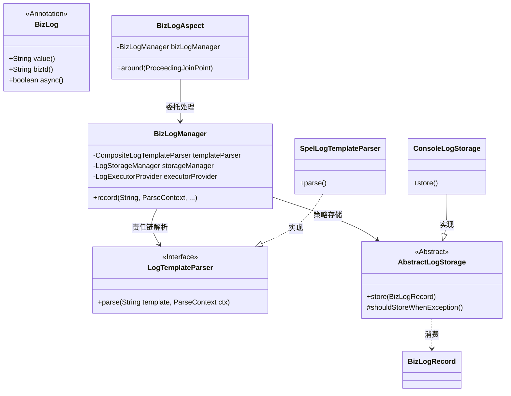
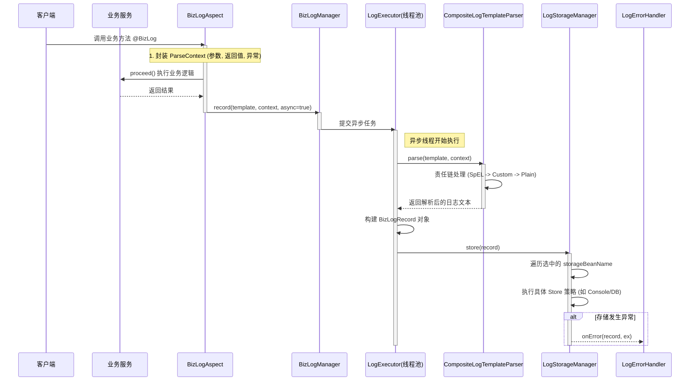

# biz-log-spring-boot-starter 架构设计文档

## 1. 项目背景与核心痛点 (Background)

### 1.1 为什么开发这个 Starter？

在复杂的业务系统开发中，操作日志（Audit Log）是必不可少的功能。传统的手动记录方式存在以下核心痛点：

*   **代码侵入严重**：业务代码中混杂着大量的 `log.info("用户" + id + "修改了订单" + orderNo)`，导致核心业务逻辑晦涩难懂。
*   **性能瓶颈**：日志的持久化（特别是写数据库或发送到 ES）通常涉及 IO 操作，同步执行会显著拖慢核心业务接口的响应速度。
*   **逻辑复用难**：不同模块的日志格式不统一，且缺乏统一的解析引擎（如解析对象属性、处理集合等）。
*   **维护困难**：当需要更换日志存储介质（如从数据库迁移到 ES）时，需要修改大量业务代码，违反“开闭原则”。

### 1.2 解决方案 (Solution)

本项目 `biz-log-spring-boot-starter` 基于 Spring Boot Starter 机制，采用 **AOP 切面 + 异步线程池 + 策略模式** 重构日志记录流程。

*   **声明式记录**：通过 `@BizLog` 注解即可完成日志记录，支持 SpEL 表达式动态取值，业务代码零侵入。
*   **高性能**：内置异步线程池处理日志解析与存储，确保主业务流程低延迟。
*   **高扩展性**：基于策略模式和责任链模式，支持自定义模版解析器、存储策略和错误处理逻辑。
*   **即插即用**：利用 Spring 自动装配机制，引入依赖配置即可生效。

---

## 2. 核心架构设计 (Architecture)

### 2.1 模块划分

```text
biz-log-parent
├── biz-log-core              # 核心组件 (Aspect, Manager, Parser, Storage)
├── biz-log-autoconfigure     # 自动配置 (AutoConfiguration)
└── biz-log-spring-boot-starter # Starter 入口
```

### 2.2 核心类图 (Class Diagram)

架构的核心在于将“日志触发”、“内容解析”与“持久化存储”三个阶段解耦。



---

## 3. 详细设计与核心流程

### 3.1 异步日志记录时序图 (Sequence Diagram)

这是一次使用注解方式记录日志的完整请求处理流程，展示了请求是如何被切面拦截并异步落库的。



### 3.2 核心组件解析

#### A. BizLogManager (核心管理器)

*   **职责**：门面模式（Facade）的实现。对外提供统一的日志记录入口（无论是注解触发还是手动调用）。
*   **核心逻辑**：
    1.  接收原始模版和上下文。
    2.  判断同步/异步执行。
    3.  协调 `TemplateParser` 进行文本解析。
    4.  协调 `LogStorageManager` 进行持久化。

#### B. CompositeLogTemplateParser (模版解析责任链)

*   **职责**：管理所有的解析器，按优先级处理日志模版。
*   **设计模式**：**责任链模式**。
    *   持有 `List<LogTemplateParser>`。
    *   默认包含 `SpelLogTemplateParser` (Order=1) 和 `PlainTextLogTemplateParser` (Order=Max)。
    *   允许用户通过实现接口并添加 `@Order` 插入自定义解析逻辑（例如敏感词过滤、特殊占位符替换）。

#### C. AbstractLogStorage (抽象存储策略)

*   **职责**：定义日志存储的标准行为。
*   **设计模式**：**模板方法模式**。
    *   `store(BizLogRecord)` 方法定义了标准流程：`try { doStore() } catch { handleException() }`。
    *   提供了 `shouldStoreWhenException` 等钩子方法，允许子类控制在业务抛出异常时是否仍记录日志。

---

## 4. 主要设计模式应用分析

### 4.1 策略模式 (Strategy Pattern)

**应用场景**：日志的多样化存储

**实现位置**：

1.  **LogStorageManager** 作为策略上下文
2.  **AbstractLogStorage** (实现 LogStorage) 作为策略基类
3.  **ConsoleLogStorage, CustomLogStorage** 等作为具体策略

**代码示例**：

```java
// 策略接口（抽象类）
public abstract class AbstractLogStorage {
    public abstract void store(BizLogRecord record);
}

// 策略上下文
public class LogStorageManager {
    private final Map<String, AbstractLogStorage> storageMap;

    public void store(BizLogRecord record, String... beanNames) {
        // 根据注解传入的 beanName 动态选择策略执行
        for (String name : beanNames) {
            storageMap.get(name).store(record);
        }
    }
}
```

**设计优势**：

- **解耦**：业务层只需指定存储器名称，无需关心是写文件还是写 DB。
- **扩展**：新增 ES 存储只需新建一个 Bean 继承 `AbstractLogStorage`，完全不修改核心代码。
- **多路分发**：支持一条日志同时写入多个介质（如同时打控制台和发 Kafka）。

### 4.2 责任链模式 (Chain of Responsibility)

**应用场景**：日志模版的分级解析

**实现位置**：

1.  **CompositeLogTemplateParser** 作为链的管理者
2.  **LogTemplateParser** 作为节点接口
3.  **SpelLogTemplateParser** (处理 SpEL) 和 **PlainTextLogTemplateParser** (兜底)

**代码示例**：

```java
public class CompositeLogTemplateParser implements LogTemplateParser {
    private final List<LogTemplateParser> parsers; // 由 Spring 自动注入并排序

    @Override
    public String parse(String template, ParseContext ctx) {
        // 依次调用解析器，直到解析完成或全部执行
        for (LogTemplateParser parser : parsers) {
            if (parser.support(template)) {
                return parser.parse(template, ctx);
            }
        }
        return template;
    }
}
```

**设计优势**：

- **灵活性**：如果 SpEL 解析失败，可以降级到纯文本解析。
- **可插拔**：用户可以定义一个高优先级的解析器来处理特殊的 `${...}` 语法，而不破坏原有的 SpEL 功能。

### 4.3 模板方法模式 (Template Method Pattern)

**应用场景**：统一存储流程与异常控制

**实现位置**：**AbstractLogStorage**

**流程模板**：

```
1. 检查是否需要记录 (preCheck)
2. 执行具体存储逻辑 (doStore - 抽象方法)
3. 捕获存储异常 (handleException)
```

**设计优势**：

- 统一了所有存储器的异常处理逻辑，防止因为日志存储失败导致业务事务回滚（除非特意配置）。

---

## 5. 配置驱动与拓展 (Usage & Extension)

### 5.1 YAML 核心配置

```yaml
biz:
  log:
    enabled: true
    storage-bean-name: 
      - consoleLogStorage # 默认策略
    async:
      core-pool-size: 4   # 异步线程池配置
    parser:
      spel:
        enabled: true     # 启用 SpEL 解析
```

### 5.2 业务扩展示例：自定义存储到数据库

开发者只需实现 `AbstractLogStorage` 并注册为 Bean。

```java
@Component("dbLogStorage")
public class DbLogStorage extends AbstractLogStorage {
    
    @Autowired
    private LogMapper logMapper;

    @Override
    public void store(BizLogRecord record) {
        SysLog sysLog = convert(record);
        logMapper.insert(sysLog);
    }
    
    @Override
    protected boolean shouldStoreWhenException(Throwable ex) {
        return true;
    }

    @Override
    protected void handleException(Throwable ex) {
        log.error("【操作日志】发生异常: {}", ex.getMessage());
    }
}
```

### 5.3 业务扩展示例：上下文传递

解决异步线程中 `ThreadLocal` (如 UserContext) 丢失的问题。

1.  **配置扩展**：实现 `BizLogAspect.ExtendParseContextExtraValue`。
2.  **自动捕获**：切面执行时自动将主线程上下文放入 `BizLogRecord.extras`。
3.  **恢复使用**：在 `LogStorage` 中从 `extras` 取出并恢复。

```java
@Bean
public BizLogAspect.ExtendParseContextExtraValue securityContextExtra() {
    // 在主线程执行，捕获上下文
    return () -> Map.of("currentUser", UserContext.get());
}
```

